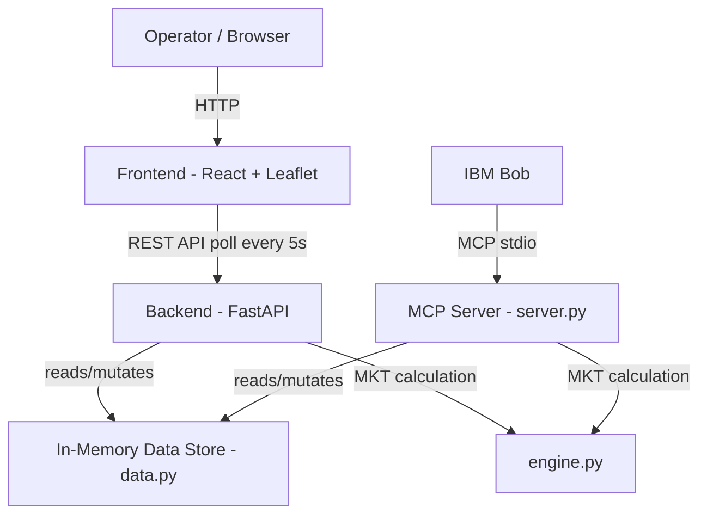

# Architecture

## System Architecture

## Components

| Component | Technology | Responsibility |
|---|---|---|
| Frontend | React 18 + TailwindCSS + Leaflet | Control-tower dashboard: live map, shipment/fleet cards, alert center, settings |
| Backend API | FastAPI (`src/backend/main.py`) | Serves `/api/shipments`, `/api/disruptions`, `/api/idle-fleet`; simulates GPS drift; executes rescue dispatch |
| MKT/Severity Engine | Python (`src/backend/engine.py`) | Arrhenius-equation Mean Kinetic Temperature calculation and severity classification, shared by both the REST API and the MCP server |
| IBM Bob Integration | MCP server over stdio (`src/mcp-server/server.py`) | Exposes `scan_active_disruptions`, `evaluate_shipment_excursion`, `execute_emergency_rescue` as tools Bob can call directly |
| Data Layer | In-memory Python structures (`src/backend/data.py`) | Shipments, disruptions, and idle fleet — single source of truth shared by both the API and MCP server |

## Data Flow

1. `src/backend/data.py` holds the live shipment, disruption, and idle-fleet records with
   `lat`/`lng` coordinates, driver info, and temperature history.
2. On each `/api/shipments` or `/api/idle-fleet` call, the backend nudges each location's
   coordinates slightly (`_drift()`) and runs `evaluate_excursion_severity()` to attach a
   fresh MKT/severity reading.
3. The React dashboard polls these endpoints every 5 seconds and re-renders the Leaflet map,
   KPI cards, and priority queue with the latest data.
4. Independently, IBM Bob calls the same underlying data and logic through the MCP server's
   three tools — so a natural-language request ("rescue SHP-8801") and a dashboard button
   click both go through the same `execute_emergency_rescue` code path and mutate the same
   in-memory shipment state.
5. A triggered rescue selects the nearest idle reefer by `distance_miles`, builds an ordered
   action plan, and updates the shipment's `status` to `RESCUE_DISPATCHED`, which both the
   dashboard and Bob will reflect on their next read.

## Security Considerations

- No credentials are hardcoded; `src/.env.example` documents the required
  `WATSONX_API_KEY` / `WATSONX_PROJECT_ID` variables without real values.
- CORS is currently open (`allow_origins=["*"]`) for local hackathon demo convenience —
  documented here as something to lock down before any production use.
- The MCP server runs over local stdio transport only — no network-exposed attack surface
  in the current build.

## Scalability Notes

The FastAPI backend is stateless aside from the in-memory `data.py` structures, so it could
be moved behind a real database (Postgres) and horizontally scaled without changing the API
contract. The MCP tools would need to read/write the same database instead of in-process
Python lists so that Bob and the REST API stay consistent once there's more than one backend
instance running.